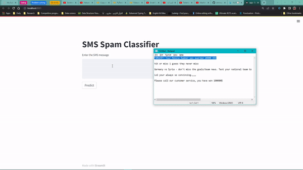

# SMS Spam Classifier

This project is a web application that allows users to identify SMS messages and get predictions wheather it's a HAM or SPAM message. The application uses various machine learning models, RNN & BERT to classify texts, achieving an accuracy of around 97%.

## Table of Contents
* [Dataset](#Dataset)
* [Technologies](#Technologies-Used)
* [Website Interface](#Website-Interface)
* [Conclusion](#Conclusion)

## Dataset
The project used [this](https://www.kaggle.com/datasets/uciml/sms-spam-collection-dataset) dataset to train the models:

## Technologies Used
* NLTK
* Sklearn, RNN & BERT for model building
* Streamlit 

## Website Interface
The website has a simple and intuitive interface that allows users to type texts and classify them. The user can type the SMS he recivies in a textbox in the webpage, the application shows the predicted result on wether the text is spam or not.

# Conclusion
This project successfully classified texts with an accuracy of around 97%. The use of machine learning models and NLTK for data cleaning and preparation allowed for effective text classification. The user interface also provided a seamless experience for users to type and classify texts.
To launch the project, navigate to the `server` folder and type `streamlit app.py` in the command prompt or terminal.

